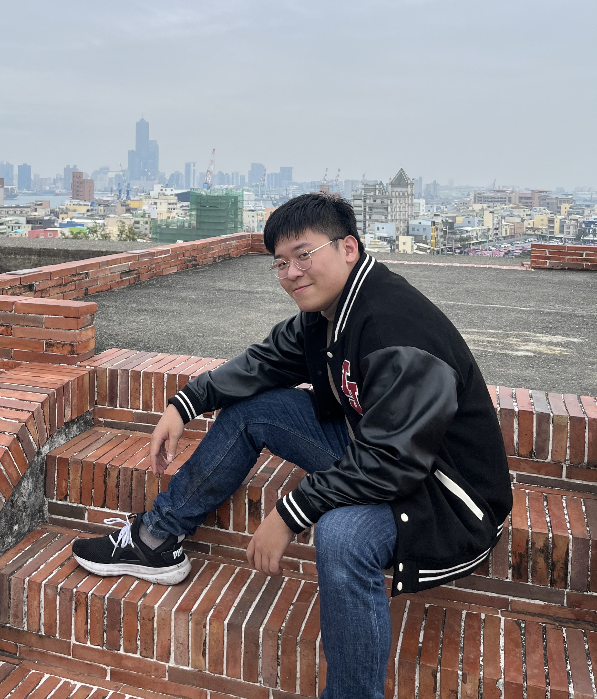

# Chen_project
This is William Chen's brainhack school project repo.

# About me
I’m William Chen. I’m currently a first-year master’s student at GIBMS, and my main research focuses on functional connectivity and cognitive training interventions.
This semester, I’m both a student in Brain Hack School and also serving as a TA.

I’m really looking forward to learning with all of you—nice to meet you!

# Expertise and research topic
- neural science
- functional connectivity
- computer science
